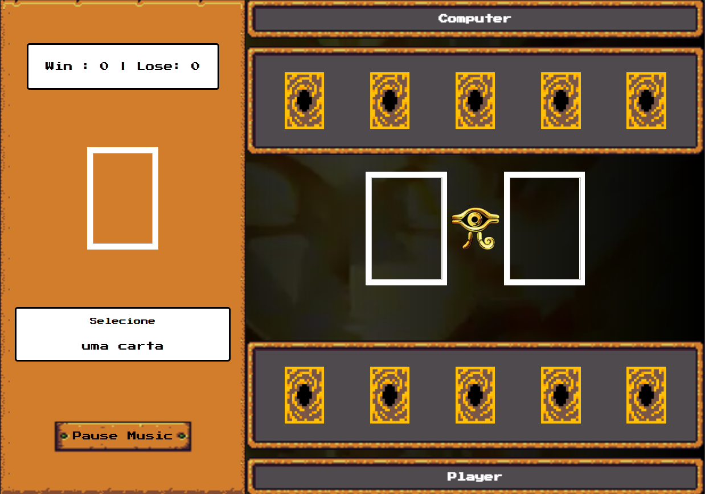
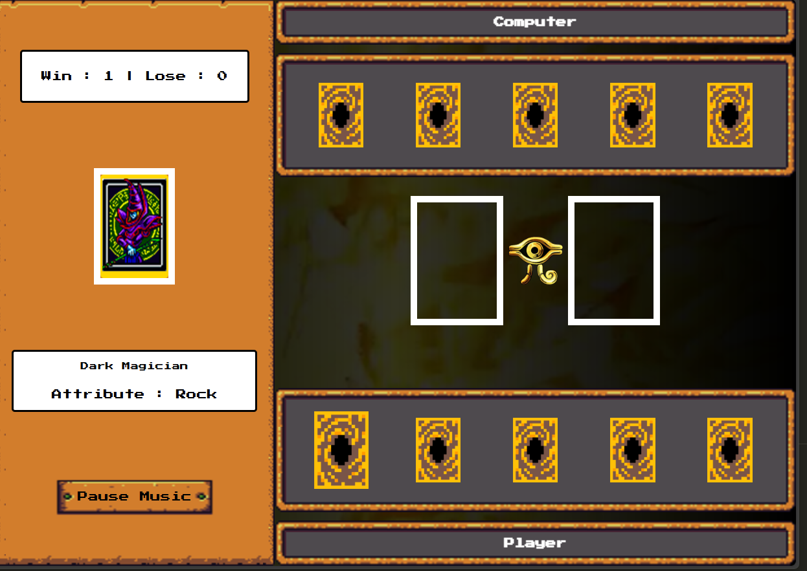
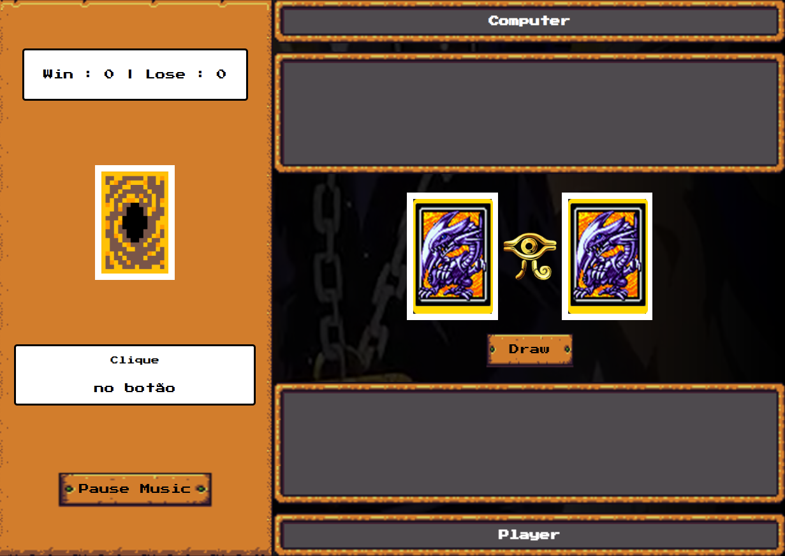

# Yu-Gi-Oh | Jo-ken-po Edition

💎 Repo for practicing JavaScript 💎

👀 I'm here to improve my skills ...

🌱 I’m currently learning in this repo: JavaScript

💞️ These are some funcions that I've done here:

Code using JavaScript, framework RPGUI, guided by DIO.me training platform.

